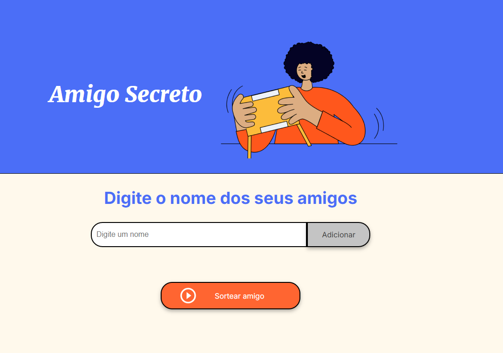
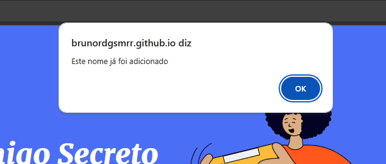
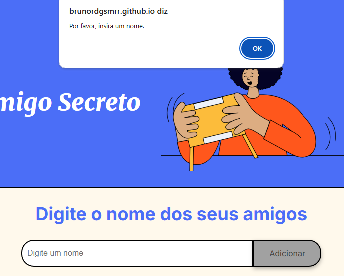
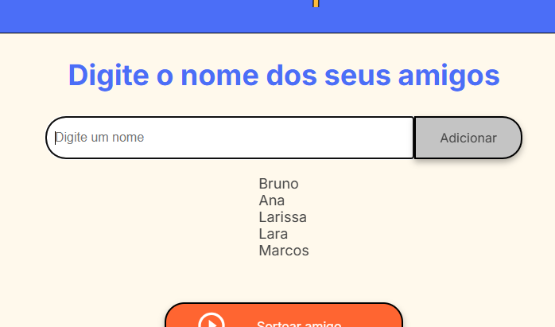
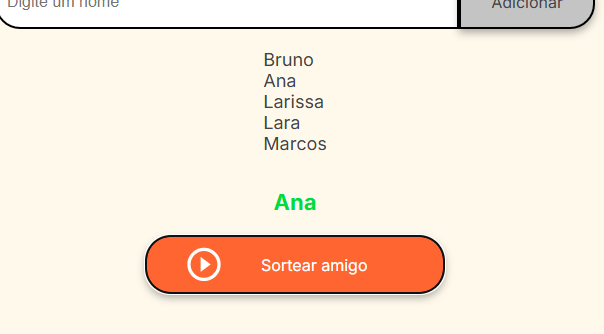

# Amigo secreto

Esté código é a minha resposta ao desafio, "Amigo secreto" da Oracle ONE

1. [Funcionalidades](#funcionalidade)
2. [Link para o jogo](#link)

## Funcionalidade

**Adicionar participante**
Ao acessar o site é possível adicionar os nomes dos participantes, esta função realiza uma verificação para saber se o nome é válido ou não.

 

**Lista de participantes**
Está aplicação possui uma função que lista o nome de todos os participantes.

**Sortear amigo**
Após adicionar os nomes é possível sortear um amigo secreto.

## Link

[https://brunordgsmrr.github.io/challenge-amigo-secreto_pt/](https://brunordgsmrr.github.io/challenge-amigo-secreto_pt/)

